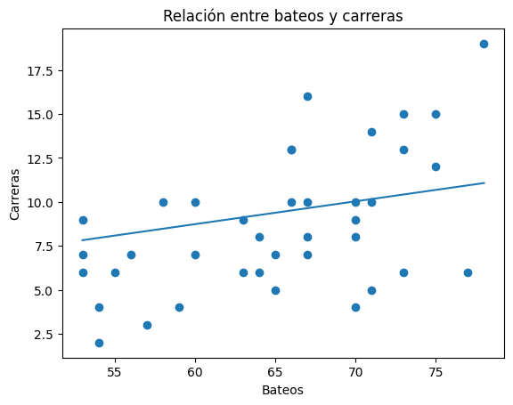
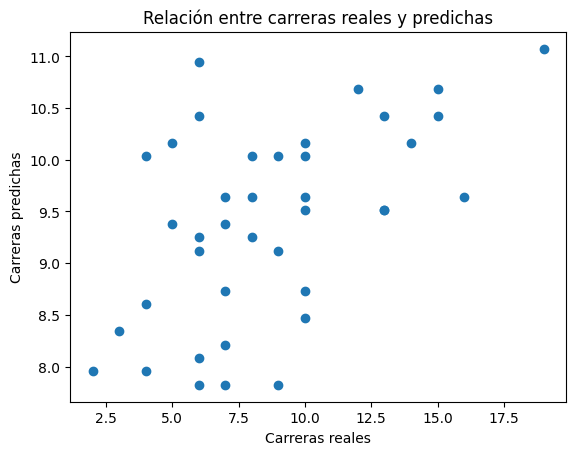

# Actividad 3
[Ver el análisis del dataset](./Actividad3/Analisis.ipynb)

## Objetivo
Desarollar un modelo de regresión lineal simple para predicar el número de carreras(R) en función del número de bateos(AB), utilizando datos reales de ESPN, buscando además evaluar al modelo mediante ciertas métricas y gráficas

## Análisis exploratorio
Se calculó el coeficiente de correlación entre las variables AB y R obteniendo una relación positiva entre ambas, lo que significa que generalmente a mayor número de bateos, mayor número de carreras.

## Modelo
En el modelo se utilizaron como variable independiente al número de bateos, mientras que el dependiente es el número de carreras. El modelo fue entrenado con el conjunto de datos de entrenamiento y posteriormente evaluado.

## Evaluación
Como ya vimos, el desempeño del modelo se evalúo utilizando el error absoluto medio, el error cuadrático medio, la raíz del error cuadrático medio y el coeficiente de determinación. Todas estas métricas nos ayudan a darnos una idea de la baja precisión del modelo, ya que hay una diferencia considerable entre loas valores predichos y los reales.

## Visualizaciones
### Relación bateos y carreras

La gráfica muestra una tendencia positiva entre las variables, pero con una dispersión considerable

### Relación carreras reales y predichas

Se observa que el modelo tiende a concentrar las predicciones en un rango reducido, lo que provoca errores en valores extremos.